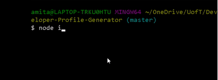

# Developer-Profile-Generator

## Table of Contents

- [Description](#description)
- [Features](#features)
- [Getting-Started](#Getting-Started)
- [Installation](#installation)
- [Link](#link)
- [Technologies](#Technologies)
- [Author](#Author)
- [Acknowledgments](#Acknowledgments)

## Description

A simple github profile generator application with dynamically updated HTML and pdf based on user input. The output powered by Node.js and ES6. It uses the Axios, Inquirer, and html-pdf-to npm packages to generate a beautiful PDF document of a developer's GitHub profile based on their username.

## Features

- Quick and easy to use
- Options to choose general color available
- Displays: picture, name, company, location, GitHub URL, blog URL, count of repos, count of starred repos, count of followers, and count of people following

## Getting-Started

The application will be invoked with the following command: node index.js. The user will be prompted for their GitHub username as well as their favorite color. The app will then generate a html file and a pdf file with the user's GitHub information and favorite color set to the background.

## Link

- The sample ouput can be accessed via the link https://amitabh-k.github.io/Developer-Profile-Generator/

- The code can be accessed via the link  https://github.com/Amitabh-K/Developer-Profile-Generator

## Technologies

* Node.js
* ES6
* HTML

## Author

* **Amitabh Kumar**

## Acknowledgments

* Ali Maqsood & David Bland's (instructors) help on the content delivery
